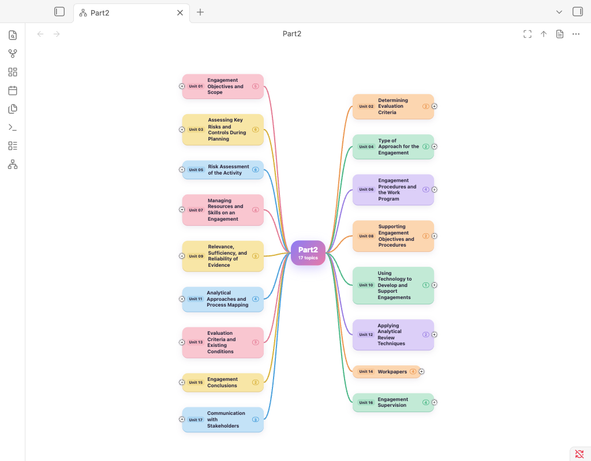
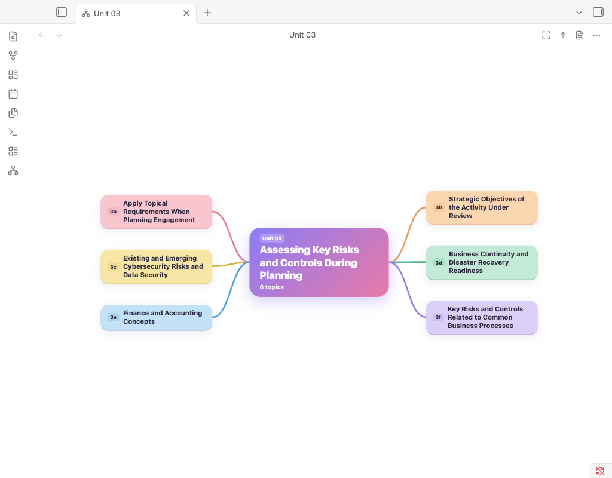
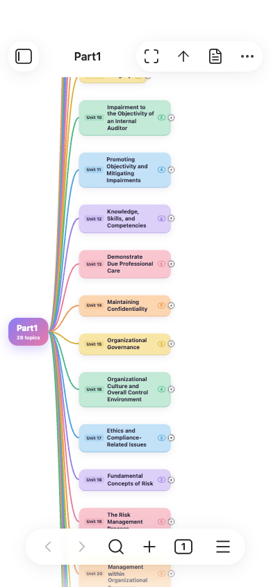
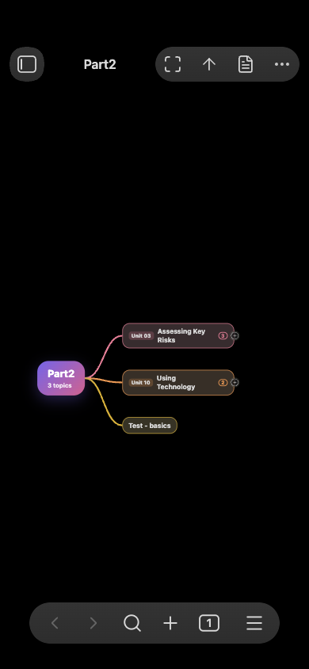

# Mind Studio

**Your vault as a colourful mind map.** Folders, notes and headings become branches you can fold, tap and open, on
desktop and on your phone.

> **Prototype (0.1.0).** This first release shows the map and lets you explore it. Links between notes, workflows,
> adding topics from the map and study progress from [Flashcard Studio](https://github.com/Almalkiid/flashcard-studio)
> come next (see [What's next](#whats-next)). Feedback is welcome in the issues.



## What it does

- **Maps any folder, any note, or the whole vault.** Right-click a folder or note and choose **Open as mind map**, use
  the ribbon icon, or run one of the commands.
- **Builds the map from what is already there.** Folders and notes become branches, and each note's headings become its
  sub-topics. A folder that holds a single note is shown as that note, and a note's first `# Title` names it.
- **Reads numbered names.** "Unit 03 - Workpapers" shows a small **Unit 03** tag next to **Workpapers**; "3a. Scope"
  shows **3a** next to **Scope**.
- **Colours each branch.** Every main branch gets its own soft colour, carried by its sub-topics. Light and dark mode
  follow Obsidian.
- **Fits your screen.** On a desktop, branches grow on both sides. On a phone (or a narrow pane) they grow to one side
  and big maps open folded, so the text stays readable.
- **Stays current.** Add, rename or edit notes and the map updates, keeping what you folded.
- **Never changes your notes.** The prototype only reads your vault.



| On a phone | Dark mode |
| --- | --- |
|  |  |

## Using the map

- **Tap a topic** to select it, and **tap it again** to open it: a note opens at that heading, and a folder becomes the
  centre of the map.
- **Tap the small ⊕ / ⊖ button** next to a topic to fold or unfold its branch.
- **Drag** to move around and **pinch** (or scroll with Ctrl/⌘) to zoom.
- The buttons at the top of the map: **open** the selected topic, go **up** to the parent folder, and **fit** the map to
  the screen. The **back** button returns to the map you came from.

Commands: _Open mind map of the current folder_, _Open mind map of the current note_, _Open mind map of the whole vault_.

## Install

Mind Studio is not in the community plugin directory yet. To try it:

- **With [BRAT](https://github.com/TfTHacker/obsidian42-brat):** add the beta plugin `Almalkiid/mind-studio`.
- **By hand:** download `main.js`, `manifest.json` and `styles.css` from the
  [latest release](https://github.com/Almalkiid/mind-studio/releases/latest) into
  `<your vault>/.obsidian/plugins/mind-studio/`, then turn on **Mind Studio** in Settings → Community plugins.

## Known limits

- Folds are remembered by a heading's position, so adding a heading above a folded one can move the fold down by one.
- The soft card colours need iOS 16.2 or later; on older iPhones the cards show without their fill.

## What's next

- **Links:** links between notes as extra branches, and dashed lines when a note appears in two places.
- **Workflows:** a numbered list of links drawn as steps, 1 → 2 → 3.
- **Add topics from the map:** Tab and Enter on a desktop, a **+** button on a phone; a new topic is a new linked note.
- **Study progress:** with Flashcard Studio installed, a ring on each topic for how much of it you have mastered, and a
  button to study a branch.
- **Looks:** a hand-drawn Sketch theme, branches that grow when they unfold, and search.

## Development

```sh
pnpm install
pnpm build        # type-check and bundle to build/main.js and styles.css
pnpm test         # unit tests (the map builder and the cards)
pnpm test:e2e     # real Obsidian, desktop and an emulated phone (wdio-obsidian-service)
pnpm lint
```

The map is drawn with [Mind Elixir](https://github.com/SSShooter/mind-elixir-core) (MIT), pinned to 5.15.1. Only
`src/render/mind-elixir-renderer.ts` knows about it; everything else works with the plugin's own `MapNode` tree.

## License

MIT
